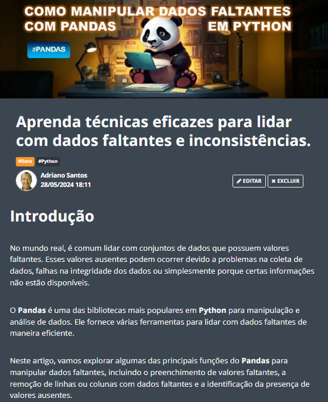

# Prompts for Article Generate by IA

Projeto com o objetivo de gerar um artigo técnico com um layout rico, leitura agradável e com foco em promover minha autoridade e conhecimento técnica.

    

  
  

-------

  

# Projeto artigo técnico gerado por I.A.s

 > ℹ️ **NOTE:** Este é o repositório desenvolvido durante o curso no qual fui aluno técnico na plataforma da [DIO](https://dio.me).

Projeto com o objetivo de gerar um artigo técnico com um layout rico, leitura agradável e com foco em promover sua autoridade técnica.

<a href="https://web.dio.me/articles/aprenda-tecnicas-eficazes-para-lidar-com-dados-faltantes-e-inconsistencias?back=%2Farticles&page=1&order=oldest" title="View PDF now"> 📕Clique aqui para ler o artigo</a>

## 💻 Tecnologias utilizadas no projeto

- [ChatGPT](https://chat.openai.com/) & [Phind](https://www.phind.com/) - para título e conteúdo
- [Lexica.art](https://lexica.art/) & [Ideogram](https://ideogram.ai/t/explore) - para gerar imagens
- [PowerPoint](https://www.microsoft.com/en/microsoft-365/powerpoint) - Para formatação de banners e Layouts

## 📄 Prompts e ferramentas

ChatGPT：

|   Ação   | prompt                                                                                                                                                                                                                                                                         |
| :------: | ------------------------------------------------------------------------------------------------------------------------------------------------------------------------------------------------------------------------------------------------------------------------------ |
|  título  | Crie 10 headlines para nomes de artigos sobre o assunto Python - Pandas    |                                                                                                                                                                                               
| conteúdo | Comporte-se como um escritor de artigos Tech Data Analytics e escreva o Artigo atendendo as regras abaixo.  |

{REGRAS}
> Tenha sub títulos separados por blocos para cada parte do artigo
> No máximo 5 linhas por blocos de explicação
> Explique de maneira informal, como se eu fosse uma criança de 10 anos
> Os blocos que serão criados estão abaixo:
- O que são dados faltantes
- O que são dados inconsistências
- Quais as consequências em ter esses dados faltantes
- Quais as técnicas eficazes para lidar com dados faltantes
- Cite exemplos com código que mostre as técnicas para lidar com esses dados faltantes
- Faça um call to action para as minhas redes sociais
- Coloque 3 hashtags que façam sentido

#### Lexica.art e Ideogram：

- No léxica utilizamos o acervo público de imagens geradas por outras pessoas e no Ideogram utilizamos para criar outras imagens.

## ✨ Features

- Conteúdo gerado via ChatGPT e via Phind
- Imagens do acervo público geradas via Lexica.art outras imagens criadas no Ideogram

## 📚 Materiais

- prompts utilizados

## 🛠️ Instruções de execução

Utilize os prompts acima nas ferramentas sugeridas para gerar o material base e utilize uma ferramenta de edição de documentos como power point, libreoffice , indesign para diagramação, o passo a passo em vídeo pode ser conferido na plataforma da [DIO](https://dio.me).

## 👨‍💻 Expert

    
    
&nbsp&nbsp&nbspFelipe Aguiar 
    &nbsp&nbsp&nbsp
    <a href="https://github.com/felipeAguiarCode">
    GitHub</a>&nbsp;|&nbsp;
    <a href="www.linkedin.com/in/
felipe-exe">LinkedIn</a>
&nbsp;|&nbsp;
    <a href="https://www.instagram.com/felipeaguiar.exe/">
    Instagram</a>
&nbsp;|&nbsp;

  

---

⌨️ com 💜 por [Felipe Aguiar](https://github.com/felipeAguiarCode)
